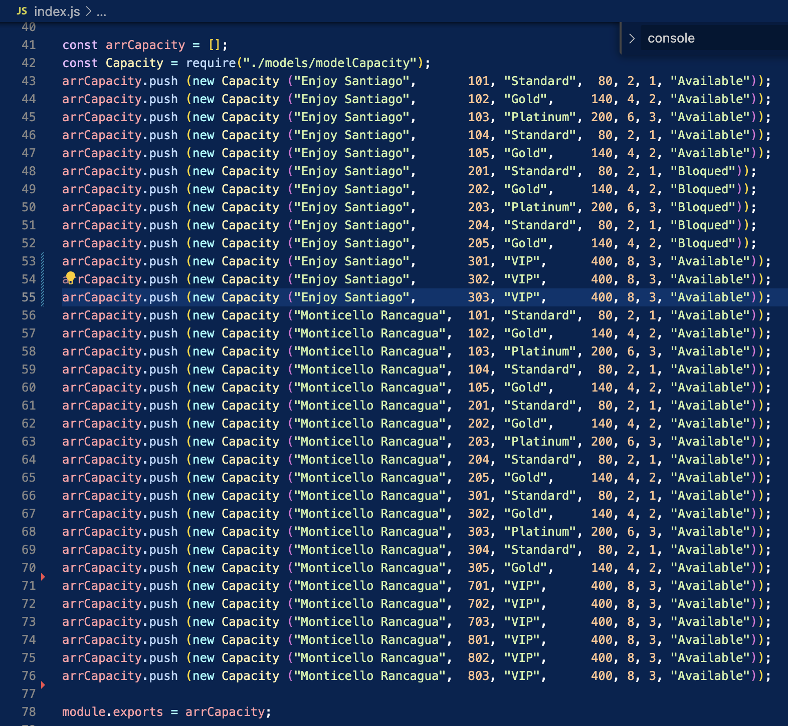
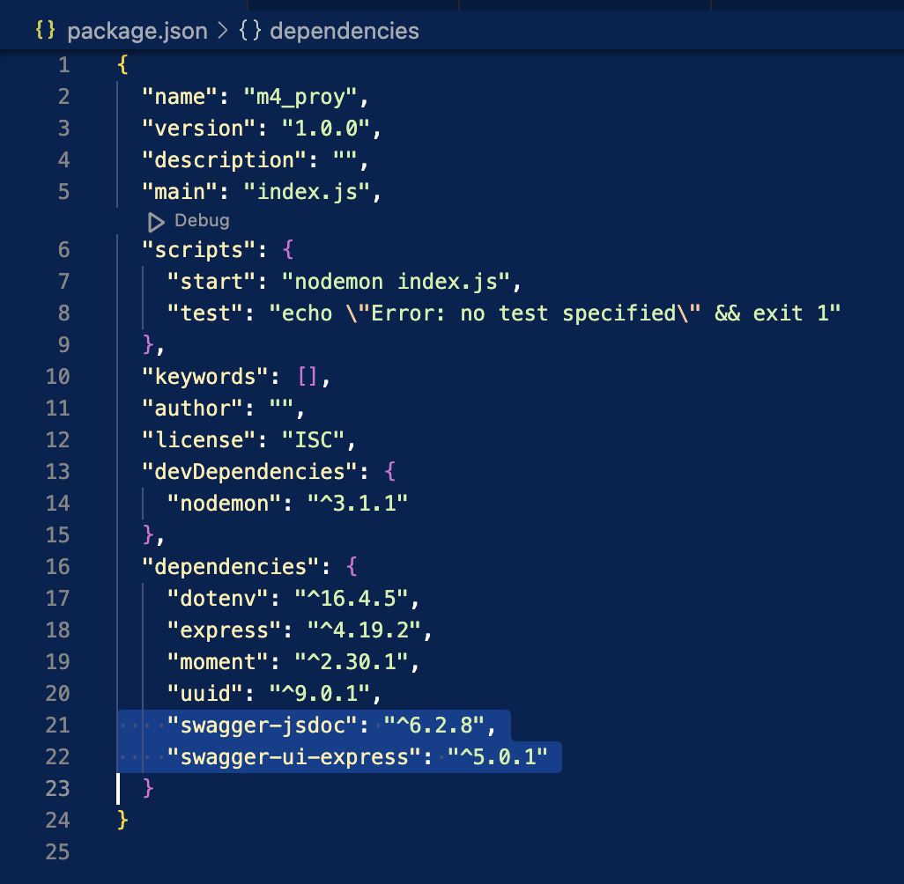
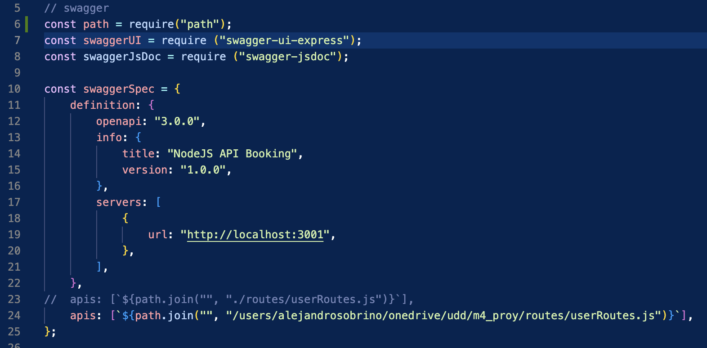
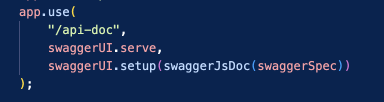
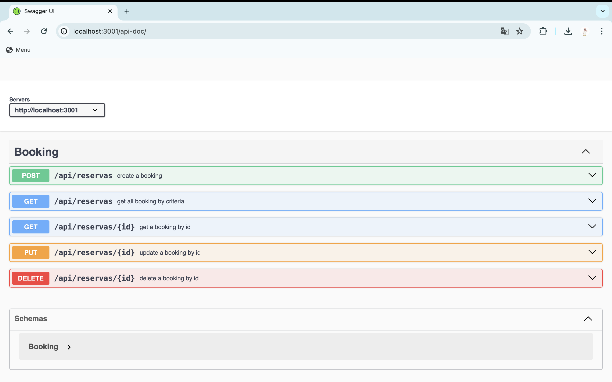
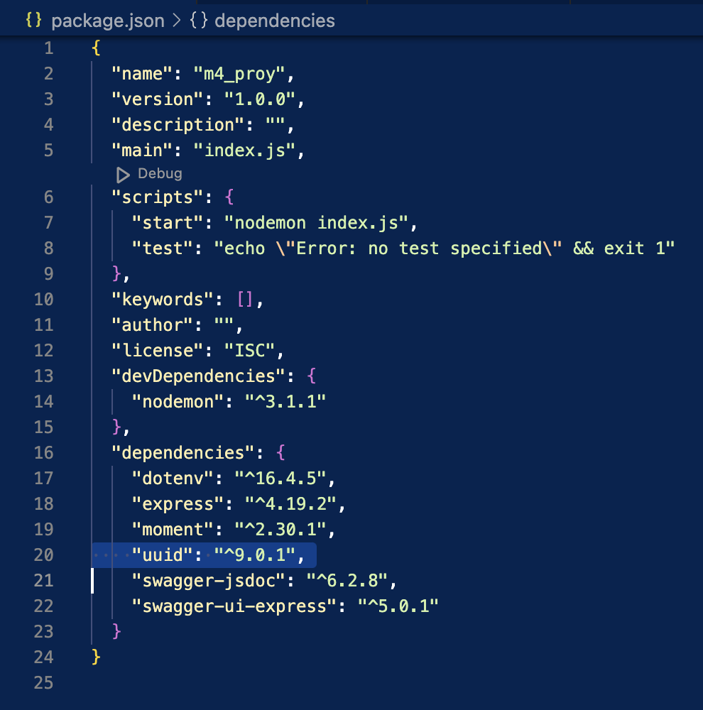

# PROYECTO 4: Reservas Hoteleras

## **ÍNDICE**

* [1. Enunciado](#1-enunciado)
* [2. Objetivos de Aprendizaje](#2-objetivos-de-aprendizaje)
* [3. Requisitos](#3-requisitos-y-entregables)
* [4. Implementación](#4-implementacion)
* [5. Para testear en Thunder Client](#5-para-testear-en-thunder-client)

****

## 1. Enunciado

En este proyecto, te encontrarás con dos actividades:

1. Construirás una aplicación de servicios para la gestión de reservas en hoteles que involucre las 4 operaciones `CRUD` y otras 6 adicionales relacionadas con filtros, utilizando Node.js y Express. 

2. Opcionalmente, realizarás un proceso de investigación relacionado con la documentación de API, usando Swagger, con la estandarización OPENAPI, la cual se utiliza en equipos internacionales para construir servicios escalables.

A continuación, determinamos las características del proyecto:

- Utilizar Node.js y Express para el desarrollo del servidor.
- Contar con un archivo `.env` para las variables de entorno, el cual establecerás el puerto.
- Contar con un archivo `.gitignore` que incluya las carpetas y archivos que deberán ocultarse para el repositorio.
- Usar una arquitectura de carpetas clara como se muestra a continuación. Es de tu gusto agregar más archivos, rutas, controladores o, si lo prefieres, sintetizar. La idea es que la asignación de responsabilidades de tu código pueda ser ubicado fácilmente.

```
EJEMPLO_TU_PROYECTO
├─ .env
├─ .prettierrc
├─ README.md
├─ controllers
│  └─ TU_CONTROLADOR.js
├─ package-lock.json
├─ package.json
├─ routes
│  └─ TU_RUTA.js
└─ server.js  <- TU ARCHIVO DE ENTRADA
```

- Implementar los siguientes 10 endpoints. 

|Descripción del Endpoint|	Método|	Endpoint| Ejemplo. Caso de uso. |
|-----------------------|----------|------------|---------|
|Crear reserva	| POST| 	/api/reservas|Como viajero, quiero hacer una reserva en el hotel "Hotel Paraíso" para el 15 de mayo de 2023. Necesito una habitación doble para dos adultos y un niño.
|Obtener la lista de reservas|	GET|	/api/reservas|Como gerente del hotel, quiero ver una lista de todas las reservas para hoy para poder planificar el trabajo del personal de limpieza y recepción.|
|Obtener información de una reserva específica	|GET|	/api/reservas/:id|Como recepcionista, necesito verificar los detalles de la reserva del huésped que acaba de llegar al hotel. Su número de reserva es 12345.
|Actualizar información de una reserva|	PUT|	/api/reservas/:id|Como huésped, necesito cambiar mi reserva en el hotel "Hotel Paraíso". Originalmente reservé una habitación doble, pero ahora necesito una suite familiar. Mi número de reserva es 12345.|
|Eliminar una reserva específica	|DELETE|	/api/reservas/:id|Como viajero, tuve un cambio de planes y ya no necesito la habitación que reservé en el hotel "Hotel Paraíso". Mi número de reserva es 12345.|
|Filtrar reservas por hotel|	GET|	/api/reservas?hotel=HOTEL|Como gerente de una cadena de hoteles, quiero ver todas las reservas para el "Hotel Paraíso" para el próximo mes.|
|Filtrar reservas por rango de fechas|	GET|	/api/reservas?fecha_inicio=FECHA_INICIO&fecha_fin=FECHA_FIN|Como gerente del hotel, quiero ver todas las reservas para la semana de Navidad para poder planificar el personal y las actividades necesarias.|
|Filtrar reservas por tipo de habitación|	GET|	/api/reservas?tipo_habitacion=TIPO_HABITACION|Como gerente del hotel, quiero ver todas las reservas para nuestras suites de lujo para el próximo mes para asegurarme de que todo esté en perfectas condiciones para nuestros huéspedes VIP.|
|Filtrar reservas por estado|	GET|	/api/reservas?estado=ESTADO|Como gerente del hotel, quiero ver todas las reservas que están pendientes de pago para poder hacer un seguimiento con los clientes.|
|Filtrar reservas por número de huéspedes|	GET|	/api/reservas?num_huespedes=NUM_HUESPEDES|Como gerente del hotel, quiero ver todas las reservas para grupos de más de 5 personas para el próximo mes, para poder planificar las necesidades adicionales de estos grupos grandes.|


- Opcionalmente, puedes utilizar este [schema](https://github.com/U-Camp/7M_FULLSTACK_M4_PROY/blob/main/schema.json) para guiarte. Si lo prefieres, puedes crearlo desde cero. Es tu decisión.
- Opcionalmente, documentar todos tus `endpoints` utilizando `Swagger` y `OpenAPI` (observa la demo para ver su implementación).
- Opcionalmente, configurar el proyecto para el despliegue en [render.com](https://render.com).

****

## 2. Objetivos de aprendizaje

- Aplicar las operaciones CRUD en un segmento de datos.
- Desarrollar una API REST
- Trabajar con datos estructurados
- Implementar la lógica de negocios
- Documentar una API

****

## 3. Requisitos y entregables

Usa esta lista para saber los requisitos mínimos del proyecto:

### GENERAL
- [ ] Realizarse de manera individual

### ARQUITECTURA DE CARPETAS

- [ ] Crear una arquitectura de carpetas y archivos, clara
 
### APLICACIÓN DE SERVICIOS CRUD

- [ ] Permitir la creación de reservas con los detalles necesarios (por ejemplo, hotel, tipo de habitación, número de huéspedes, fechas, etc.).
- [ ] Permitir la visualización de la lista de reservas.
- [ ] Permitir la obtención de la información de una reserva específica.
- [ ] Permitir la actualización de la información de una reserva.
- [ ] Permitir la eliminación de una reserva.
- [ ] Permitir la búsqueda de reservas por hotel, rango de fechas, tipo de habitación, estado y número de huéspedes.
- [ ] Almacenar los datos de las reservas en una estructura de datos.

### CONTROL DE VERSIONES

- [ ] Crear un repositorio en GitHub y subir el proyecto al mismo.

### ENTREGA A TIEMPO

- [ ] Entregar a tiempo el proyecto.

### DOCUMENTACIÓN DE LA API (OPCIONAL)

- [ ] Documentar todos los `endpoints` utilizando `Swagger` y `OpenAPI`

### DESPLIEGUE (OPCIONAL)

- [ ] Crear una URL de producción para este proyecto, a través de [render.com](https://render.com)

****

## 4. Implementación

(A) Como componentes del proyecto, deberá incluir el archivo `.env` que contiene la siguente informacion

`PORT=3001`


(B) Como componentes del proyecto, deberá incluir el archivo `.gitignore` que contiene la siguiente informacion

`.env`
`#npm install`
`node_modules`


(C) Se incorpora en `index.js` un arreglo de objetos con la información de la capacidad hotelera y asi poder sacar datos para generar reservas

 


(D) Se agregan variables y configuraciones para poder generar documentacion `Swagger OPEN API`

(D-1) En `package.json`

 


(D-3) En `index.js`

 


 


(D-4) En `userRoutes.js` se agregan comentarios con prefijo `@swagger`


(D-5) Una muestra de la aplicacion `Swagger OPEN API` resultante

 


(E) Algunos comentarios en la logica de las APIs

Para calcular el mes próximo

let   month    = moment().add(1, "months").format("MM");
let   year     = moment().add(1, "months").format("YYYY");
const dateFrom = `${year}-${month}-01`;
const dateTo   = `${year}-${month}-31`;

La sentencia a continuacion incluye `[dateFrom, dateTo]`

`moment(booking.checkIn).isBetween(dateFrom, dateTo`, "days", "[]"`)`


(F) Se agregan variables y configuraciones para obtener un id único de reserva `uuid`

(F-1) En `package.json`

 


(F-2) En `controller.js`

const { v4: uuidv4 } = require("uuid");

let id = uuidv4()


****

## 5. Para testear en Thunder Client

`Body`

{ 
    "hotel": "Enjoy Santiago",
    "room": 702,
    "category": "VIP",
    "name": "Juan Perez Gonzalez",
    "phone": "+56990022000",
    "email": "telemensajes@hotmail.com",
    "qttyGuest": 3,
    "specialFood": "Kosher",
    "checkIn": "2024-06-30",
    "checkOut": "2024-06-30",
    "paid": "Pending"
}


`Respuesta exitosa para la creación de una reserva`

{
  "msg": "Reserva creada con éxito",
  "data": {
    "id": "7b6c3299-3a76-428e-92a3-8184f8bf0855",
    "timeStamp": "2024-06-13 21:06:42",
    "hotel": "Enjoy Santiago",
    "room": 702,
    "category": "VIP",
    "name": "Juan Perez Gonzalez",
    "phone": "+56990022000",
    "email": "telemensajes@hotmail.com",
    "qttyGuest": 3,
    "specialFood": "Kosher",
    "checkIn": "2024-06-30",
    "checkOut": "2024-06-30",
    "paid": "Pending"
  }
}